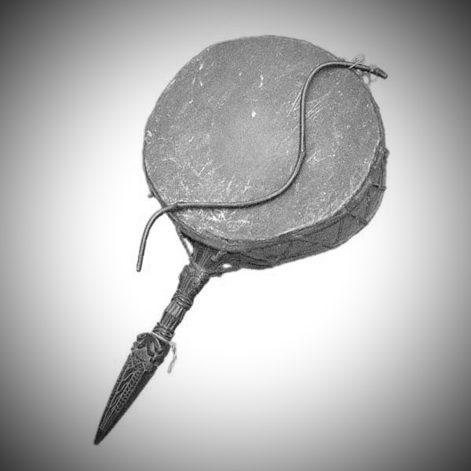

# Dhyangro
Dhyangro is a project inspired by up and coming artist Night's cause “Know your instrument”- an on-going project to document and create an environment for the new generation to learn endangered Nepali instruments.
[Nights,Know your Instruments ](http://wearenight.com/?page_id=1466)
[Forgotten Tharu Instruments](https://www.youtube.com/watch?v=Fn3ZZGvNajw)

With an understanding that the general Nepali youth is tech savvy and are more drawn to creating music with MIDI instruments, this is an effort to preserve traditional nepali instruments by having it be more accessible to the youth. 
ALthough not as pertitent as Nights prject, Lal Bahadur Reshmi Thapa and Bal Krishna Bal's publication on [Classifying Sentiments in Nepali Subjective Texts](https://ieeexplore.ieee.org/document/7785374/) has also been one of the sources of inspiration for this project. 

Scope of the Project:
Phase1:
1. Collect recordings of old Nepali instruments
2. Render those recordings via sprectal analysis to convert it into MIDI signals
3. Have the MIDI signals be accessible to public as a database

Phase2:
1. Create a GUI for accessing MIDI signals
2. Integrate Dhyangro to other softwares (FL Studio, LogicX, Garageband)

